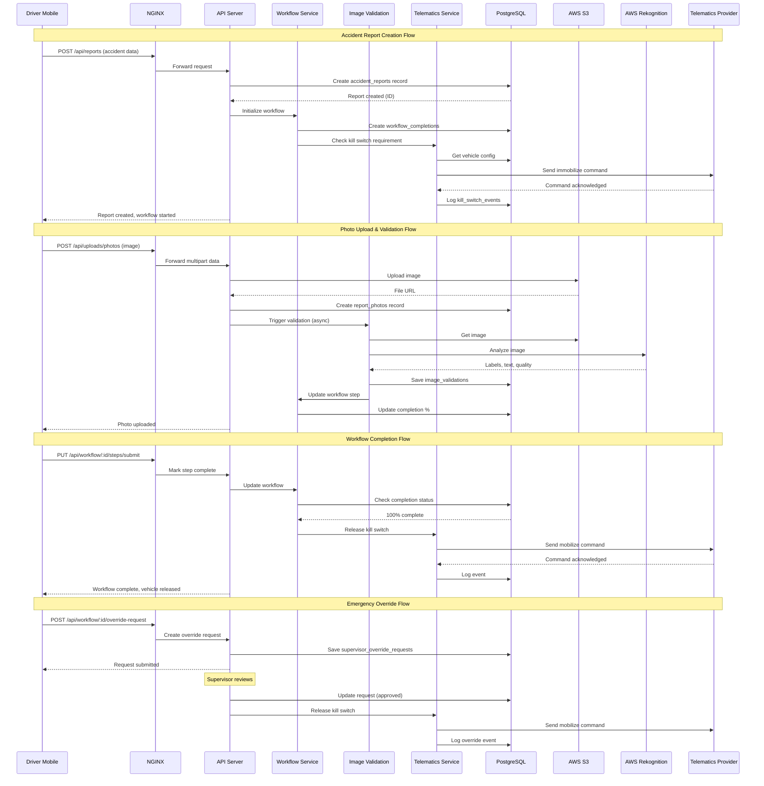
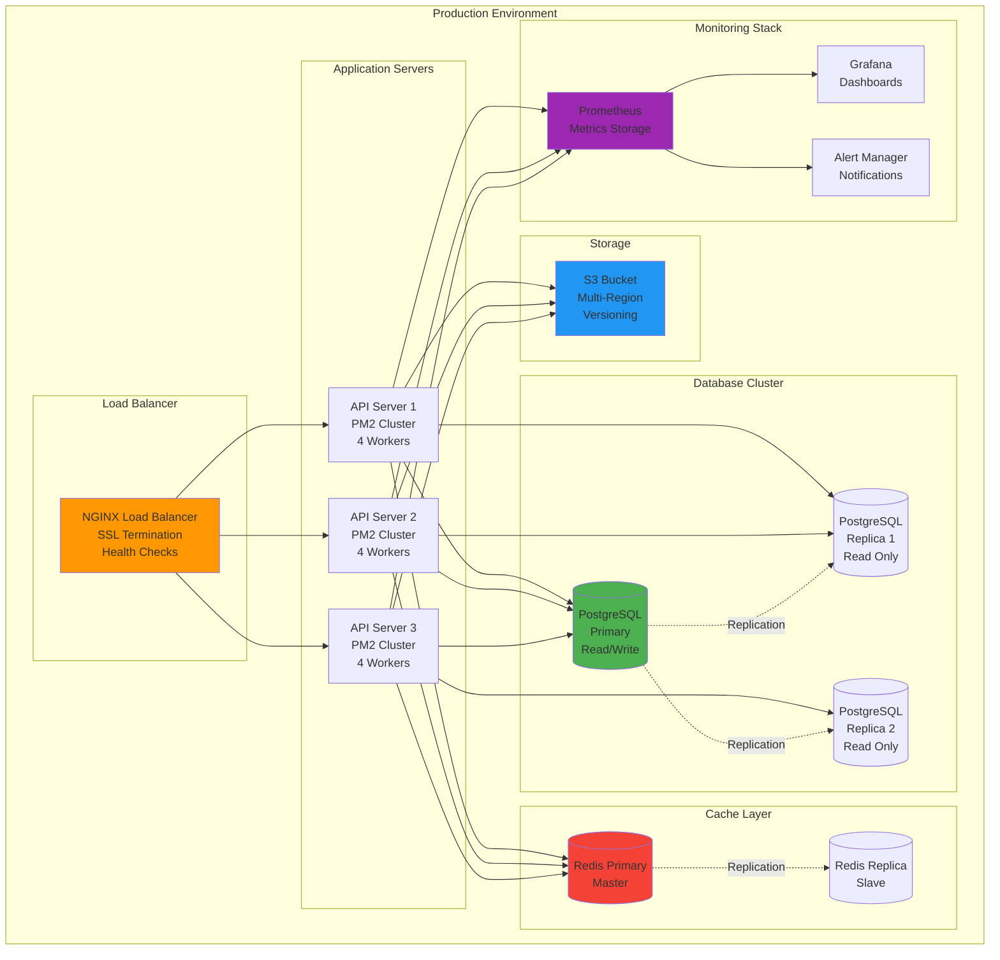
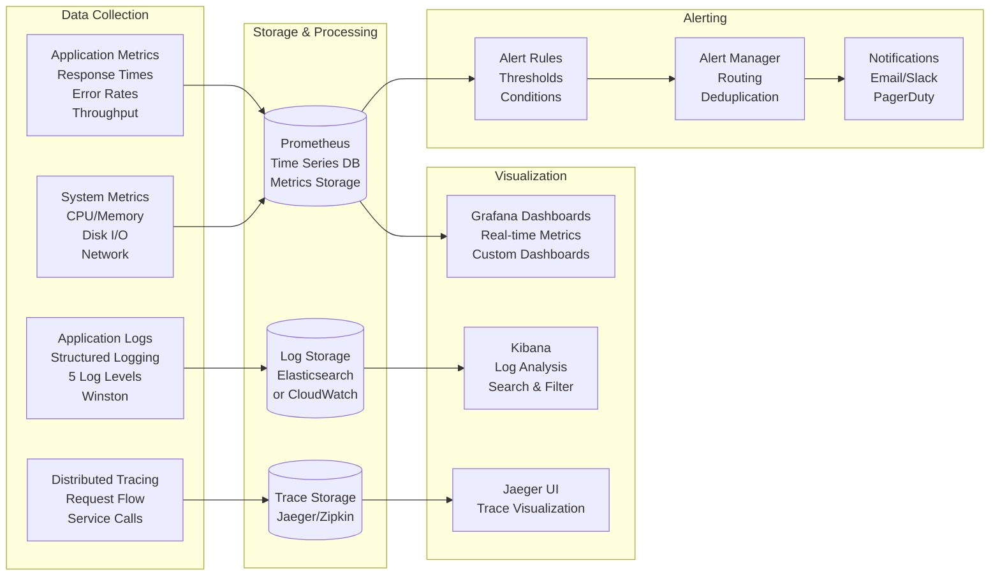
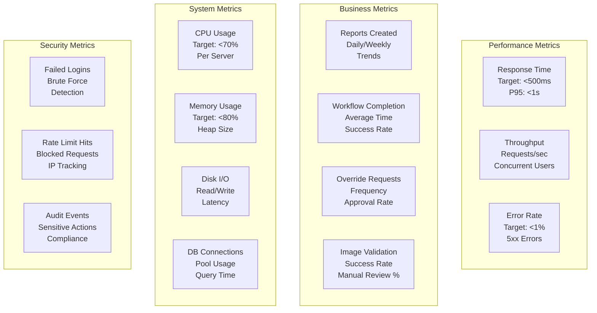

# System Architecture - Fleet Accident Reporting System

## Complete System Architecture

```mermaid
graph TB
    subgraph "Client Layer"
        MA[Mobile App<br/>React Native<br/>iOS/Android]
        WD[Web Dashboard<br/>React/Vite<br/>Fleet Managers]
        SA[Super Admin<br/>Dashboard<br/>Platform Admin]
    end

    subgraph "API Gateway Layer"
        NGINX[NGINX<br/>Reverse Proxy<br/>SSL/TLS<br/>Rate Limiting]
    end

    subgraph "Application Layer"
        API[Express API Server<br/>Node.js 18+<br/>Cluster Mode]
        
        subgraph "Core Services"
            AUTH[Auth Service<br/>JWT/Sessions]
            REPORT[Report Service<br/>CRUD Operations]
            UPLOAD[Upload Service<br/>S3 Integration]
            EXPORT[Export Service<br/>PDF/Excel/DOCX]
        end
        
        subgraph "New Services"
            IMG[Image Validation<br/>AWS Rekognition<br/>AI/ML]
            TELEM[Telematics Service<br/>Multi-Provider<br/>Kill Switch]
            WORK[Workflow Service<br/>Progress Tracking<br/>Automation]
        end
        
        subgraph "Real-time"
            WS[WebSocket Service<br/>Socket.io<br/>Live Updates]
        end
    end

    subgraph "Data Layer"
        PG[(PostgreSQL 14+<br/>Primary Database<br/>Row-Level Security)]
        REDIS[(Redis<br/>Cache/Sessions<br/>Rate Limiting)]
    end

    subgraph "Storage Layer"
        S3[AWS S3<br/>File Storage<br/>Photos/Audio/Docs]
    end

    subgraph "External Services"
        REKOG[AWS Rekognition<br/>Image Analysis<br/>OCR/Labels]
        
        subgraph "Telematics Providers"
            GEOTAB[Geotab API]
            SAMSARA[Samsara API]
            VERIZON[Verizon Connect]
            FLEET[Fleet Complete]
            TELETRAC[Teletrac Navman]
            CUSTOM[Custom Provider]
        end
    end

    subgraph "Monitoring & Observability"
        PROM[Prometheus<br/>Metrics Collection]
        GRAF[Grafana<br/>Dashboards<br/>Visualization]
        WINSTON[Winston Logger<br/>Structured Logs<br/>5 Log Levels]
        ALERT[Alert Manager<br/>Notifications<br/>PagerDuty/Slack]
    end

    subgraph "Infrastructure"
        PM2[PM2<br/>Process Manager<br/>Cluster Mode<br/>Auto-restart]
        DOCKER[Docker<br/>Containerization<br/>Compose]
    end

    subgraph "CI/CD"
        GHA[GitHub Actions<br/>Automated Testing<br/>Deployment]
        TESTS[Jest/Supertest<br/>Unit/Integration<br/>Load Tests]
    end

    %% Client to Gateway
    MA --> NGINX
    WD --> NGINX
    SA --> NGINX

    %% Gateway to API
    NGINX --> API

    %% API to Services
    API --> AUTH
    API --> REPORT
    API --> UPLOAD
    API --> EXPORT
    API --> IMG
    API --> TELEM
    API --> WORK
    API --> WS

    %% Services to Data
    AUTH --> PG
    AUTH --> REDIS
    REPORT --> PG
    UPLOAD --> S3
    UPLOAD --> PG
    EXPORT --> PG
    EXPORT --> S3
    IMG --> PG
    IMG --> REKOG
    IMG --> S3
    TELEM --> PG
    WORK --> PG
    WS --> REDIS

    %% Telematics to Providers
    TELEM --> GEOTAB
    TELEM --> SAMSARA
    TELEM --> VERIZON
    TELEM --> FLEET
    TELEM --> TELETRAC
    TELEM --> CUSTOM

    %% Monitoring
    API --> PROM
    API --> WINSTON
    PROM --> GRAF
    WINSTON --> GRAF
    GRAF --> ALERT

    %% Infrastructure
    PM2 --> API
    DOCKER --> PM2
    DOCKER --> PG
    DOCKER --> REDIS

    %% CI/CD
    GHA --> TESTS
    GHA --> DOCKER

    style MA fill:#e1f5ff
    style WD fill:#e1f5ff
    style SA fill:#e1f5ff
    style API fill:#fff4e1
    style PG fill:#e8f5e9
    style S3 fill:#f3e5f5
    style REKOG fill:#f3e5f5
    style PROM fill:#ffe0b2
    style GRAF fill:#ffe0b2
```



## Data Flow Architecture



## Database Schema

```mermaid
erDiagram
    fleets ||--o{ users : has
    fleets ||--o{ vehicles : owns
    fleets ||--o{ accident_reports : contains
    fleets ||--o{ telematics_providers : configures
    
    users ||--o{ accident_reports : creates
    users ||--o{ kill_switch_events : triggers
    users ||--o{ supervisor_override_requests : requests
    
    vehicles ||--o{ accident_reports : involved_in
    vehicles ||--o{ kill_switch_events : has
    vehicles }o--|| telematics_providers : uses
    
    accident_reports ||--o{ report_photos : contains
    accident_reports ||--o{ report_audio : contains
    accident_reports ||--|| workflow_completions : tracks
    
    report_photos ||--|| image_validations : validated_by
    
    workflow_completions ||--o{ supervisor_override_requests : has
    
    fleets {
        uuid id PK
        string name
        string company_name
        string email UK
        string phone
        text address
        string subscription_status
        timestamp created_at
        timestamp updated_at
    }
    
    users {
        uuid id PK
        uuid fleet_id FK
        string email
        string password_hash
        string first_name
        string last_name
        string phone
        enum role
        boolean is_active
        timestamp last_login
        timestamp created_at
        timestamp updated_at
    }
    
    vehicles {
        uuid id PK
        uuid fleet_id FK
        uuid telematics_provider_id FK
        string vehicle_number UK
        string vin
        string make
        string model
        integer year
        string license_plate
        string telematics_device_id
        boolean kill_switch_enabled
        enum kill_switch_status
        uuid current_driver_id FK
        decimal last_location_lat
        decimal last_location_lng
        timestamp last_location_updated_at
        boolean is_active
        jsonb metadata
        timestamp created_at
        timestamp updated_at
    }
    
    telematics_providers {
        uuid id PK
        uuid fleet_id FK
        enum provider_name
        string api_endpoint
        text api_key_encrypted
        text api_secret_encrypted
        jsonb additional_config
        boolean is_active
        timestamp last_sync_at
        timestamp created_at
        timestamp updated_at
    }
    
    accident_reports {
        uuid id PK
        uuid fleet_id FK
        uuid driver_id FK
        uuid vehicle_id FK
        string report_number UK
        enum incident_type
        enum status
        decimal latitude
        decimal longitude
        text address
        timestamp incident_date
        timestamp reported_at
        jsonb custom_fields
        timestamp created_at
        timestamp updated_at
        timestamp synced_at
        boolean is_offline
    }
    
    report_photos {
        uuid id PK
        uuid report_id FK
        uuid fleet_id FK
        string file_key
        text file_url
        integer file_size
        string mime_type
        text description
        integer order_index
        enum validation_status
        boolean validation_required
        timestamp created_at
    }
    
    image_validations {
        uuid id PK
        uuid photo_id FK
        uuid report_id FK
        uuid fleet_id FK
        enum validation_status
        enum ai_provider
        jsonb detected_labels
        jsonb detected_objects
        decimal scene_confidence
        boolean is_vehicle_damage_detected
        string damage_severity
        text extracted_text
        decimal text_confidence
        jsonb detected_license_plates
        jsonb detected_documents
        decimal image_quality_score
        boolean is_blurry
        boolean is_dark
        boolean has_faces
        integer face_count
        boolean contains_inappropriate_content
        boolean requires_manual_review
        text manual_review_reason
        uuid reviewed_by_user_id FK
        timestamp reviewed_at
        integer processing_time_ms
        text error_message
        jsonb raw_response
        timestamp created_at
        timestamp updated_at
    }
    
    workflow_completions {
        uuid id PK
        uuid report_id FK UK
        uuid fleet_id FK
        uuid vehicle_id FK
        uuid driver_id FK
        jsonb steps_required
        jsonb steps_completed
        integer completion_percentage
        boolean is_complete
        boolean kill_switch_engaged
        timestamp kill_switch_engaged_at
        timestamp kill_switch_released_at
        boolean override_requested
        boolean override_approved
        uuid override_by_supervisor_id FK
        text override_reason
        timestamp override_at
        timestamp completed_at
        timestamp created_at
        timestamp updated_at
    }
    
    kill_switch_events {
        uuid id PK
        uuid vehicle_id FK
        uuid fleet_id FK
        uuid report_id FK
        enum event_type
        uuid triggered_by_user_id FK
        uuid supervisor_id FK
        text reason
        string override_code
        decimal location_lat
        decimal location_lng
        jsonb metadata
        timestamp created_at
    }
    
    supervisor_override_requests {
        uuid id PK
        uuid workflow_completion_id FK
        uuid report_id FK
        uuid vehicle_id FK
        uuid fleet_id FK
        uuid requested_by_user_id FK
        uuid supervisor_id FK
        enum status
        text reason
        enum urgency
        timestamp approved_at
        timestamp denied_at
        timestamp expires_at
        text supervisor_notes
        timestamp created_at
        timestamp updated_at
    }
```

## API Architecture

```mermaid
graph LR
    subgraph "API Routes"
        AUTH_R[/api/auth<br/>Login/Register<br/>Session Management]
        FLEET_R[/api/fleets<br/>Fleet CRUD<br/>Configuration]
        USER_R[/api/users<br/>User Management<br/>Roles/Permissions]
        REPORT_R[/api/reports<br/>Accident Reports<br/>CRUD Operations]
        UPLOAD_R[/api/uploads<br/>File Upload<br/>S3 Integration]
        EXPORT_R[/api/exports<br/>Report Export<br/>Multiple Formats]
        TELEM_R[/api/telematics<br/>Vehicles<br/>Kill Switch<br/>Providers]
        WORK_R[/api/workflow<br/>Progress Tracking<br/>Overrides]
        ADMIN_R[/api/admin<br/>Platform Admin<br/>Analytics]
        HEALTH_R[/health<br/>Health Checks<br/>Metrics]
    end

    subgraph "Middleware Stack"
        HELMET[Helmet<br/>Security Headers]
        CORS[CORS<br/>Cross-Origin]
        RATE[Rate Limiting<br/>DDoS Protection]
        AUTH_M[Authentication<br/>JWT Validation]
        FLEET_M[Fleet Context<br/>Multi-tenancy]
        PERM[Permissions<br/>RBAC]
        VALID[Validation<br/>Input Sanitization]
        CSRF[CSRF Protection<br/>Token Validation]
        LOG[Request Logging<br/>Performance]
    end

    subgraph "Business Logic"
        AUTH_S[Auth Service]
        REPORT_S[Report Service]
        IMG_S[Image Validation]
        TELEM_S[Telematics]
        WORK_S[Workflow]
        EXPORT_S[Export Service]
        SOCKET_S[Socket Service]
    end

    AUTH_R --> HELMET
    FLEET_R --> HELMET
    USER_R --> HELMET
    REPORT_R --> HELMET
    UPLOAD_R --> HELMET
    EXPORT_R --> HELMET
    TELEM_R --> HELMET
    WORK_R --> HELMET
    ADMIN_R --> HELMET
    HEALTH_R --> HELMET

    HELMET --> CORS
    CORS --> RATE
    RATE --> AUTH_M
    AUTH_M --> FLEET_M
    FLEET_M --> PERM
    PERM --> VALID
    VALID --> CSRF
    CSRF --> LOG

    LOG --> AUTH_S
    LOG --> REPORT_S
    LOG --> IMG_S
    LOG --> TELEM_S
    LOG --> WORK_S
    LOG --> EXPORT_S
    LOG --> SOCKET_S
```

## Deployment Architecture



## Security Architecture

```mermaid
graph TB
    subgraph "Security Layers"
        subgraph "Network Security"
            WAF[Web Application Firewall<br/>DDoS Protection<br/>IP Filtering]
            SSL[SSL/TLS<br/>Certificate Management<br/>HTTPS Only]
        end
        
        subgraph "Application Security"
            AUTH_SEC[Authentication<br/>JWT + httpOnly Cookies<br/>Session Management]
            AUTHZ[Authorization<br/>RBAC<br/>Permission Checks]
            CSRF_SEC[CSRF Protection<br/>Token Validation]
            XSS[XSS Prevention<br/>Input Sanitization<br/>Content Security Policy]
            SQLI[SQL Injection Prevention<br/>Parameterized Queries<br/>ORM]
        end
        
        subgraph "Data Security"
            ENCRYPT[Encryption at Rest<br/>Database Encryption<br/>S3 Encryption]
            TRANSIT[Encryption in Transit<br/>TLS 1.3<br/>Secure Protocols]
            RLS[Row-Level Security<br/>Multi-tenancy<br/>Data Isolation]
            SECRETS[Secrets Management<br/>Environment Variables<br/>Encrypted Storage]
        end
        
        subgraph "Monitoring & Audit"
            AUDIT[Audit Logging<br/>All Actions Logged<br/>Immutable Records]
            INTRUSION[Intrusion Detection<br/>Anomaly Detection<br/>Alert System]
            COMPLIANCE[Compliance Checks<br/>GDPR/CCPA<br/>Regular Audits]
        end
    end

    WAF --> SSL
    SSL --> AUTH_SEC
    AUTH_SEC --> AUTHZ
    AUTHZ --> CSRF_SEC
    CSRF_SEC --> XSS
    XSS --> SQLI
    SQLI --> ENCRYPT
    ENCRYPT --> TRANSIT
    TRANSIT --> RLS
    RLS --> SECRETS
    SECRETS --> AUDIT
    AUDIT --> INTRUSION
    INTRUSION --> COMPLIANCE
```



## Monitoring & Observability



## CI/CD Pipeline

```mermaid
graph LR
    subgraph "Source Control"
        GIT[Git Repository<br/>GitHub<br/>Feature Branches]
    end

    subgraph "CI Pipeline"
        TRIGGER[Push/PR Trigger<br/>GitHub Actions]
        LINT[Code Linting<br/>ESLint<br/>Prettier]
        TEST[Unit Tests<br/>Jest<br/>Supertest]
        SECURITY[Security Scan<br/>npm audit<br/>Snyk]
        BUILD[Build<br/>Docker Image<br/>Tag Version]
    end

    subgraph "CD Pipeline"
        STAGING[Deploy to Staging<br/>Automated<br/>Smoke Tests]
        APPROVAL[Manual Approval<br/>Review<br/>Sign-off]
        PROD[Deploy to Production<br/>Blue-Green<br/>Zero Downtime]
        VERIFY[Verification<br/>Health Checks<br/>Monitoring]
    end

    subgraph "Rollback"
        MONITOR[Monitor Metrics<br/>Error Rates<br/>Performance]
        ROLLBACK[Automatic Rollback<br/>Previous Version<br/>If Errors]
    end

    GIT --> TRIGGER
    TRIGGER --> LINT
    LINT --> TEST
    TEST --> SECURITY
    SECURITY --> BUILD
    BUILD --> STAGING
    STAGING --> APPROVAL
    APPROVAL --> PROD
    PROD --> VERIFY
    VERIFY --> MONITOR
    MONITOR --> ROLLBACK
    ROLLBACK -.-> PROD
```



## Key Metrics & KPIs



